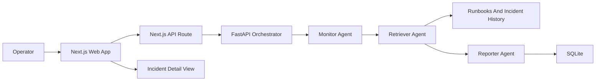

# Fleet Health Copilot

Fleet Health Copilot is a software-only capstone project for monitoring a simulated robotics or IoT fleet. It ingests telemetry, detects anomalies, retrieves operational context, and generates operator-facing incident reports.

## Architecture



- `apps/web` is the Clerk-protected Next.js dashboard.
- `services/orchestrator` is the FastAPI service for telemetry, RAG, orchestration, incidents, and metrics.
- `services/orchestrator/data` contains local seed events and runbooks.
- `services/mcp-*` contains early helper packages for future MCP tool integration.
- `packages/contracts` contains JSON schemas for API contract alignment.

## Local Setup

Install web dependencies:

```bash
npm install --workspace apps/web
```

Create and install the Python environment:

```bash
python -m venv .venv
.venv/bin/pip install -e "services/orchestrator[dev]"
```

Configure Clerk and the orchestrator URL:

```bash
cp apps/web/.env.example apps/web/.env.local
```

Set real `NEXT_PUBLIC_CLERK_PUBLISHABLE_KEY` and `CLERK_SECRET_KEY` values in `apps/web/.env.local`. The default orchestrator URL is `http://127.0.0.1:8000`.

Optional orchestrator retrieval settings:

- `FLEET_RETRIEVAL_BACKEND=lexical` keeps the local default lexical token search.
- `FLEET_RETRIEVAL_BACKEND=s3vectors` selects the AWS S3 Vectors backend skeleton.
- `FLEET_S3_VECTORS_BUCKET` and `FLEET_S3_VECTORS_INDEX` are required when `s3vectors` is selected.

The S3 Vectors backend is intentionally opt-in and not implemented yet, so local development should keep the default `lexical` backend.

## Run Locally

Start the orchestrator:

```bash
PYTHONPATH=services/orchestrator/src .venv/bin/uvicorn fleet_health_orchestrator.main:app --reload --port 8000
```

Start the web app:

```bash
npm run web:dev
```

Open `http://localhost:3000`, sign in, and use the simulation button to create a thermal incident.

## Demo Script

The local seed data covers two anomaly scenarios:

- Battery thermal drift on `robot-03`.
- Motor current spike on `robot-07`.

It also includes one normal motor-current event so the evaluation can report true negatives.

With the orchestrator running, index sample runbooks and historical incidents:

```bash
.venv/bin/python services/orchestrator/scripts/index_documents.py
```

Replay sample telemetry events:

```bash
.venv/bin/python services/orchestrator/scripts/replay_events.py
```

Run the end-to-end evaluation helper:

```bash
.venv/bin/python services/orchestrator/scripts/evaluate_pipeline.py
```

The evaluation helper posts each event to `/v1/orchestrate/event` and reports `true_positives`, `false_positives`, `false_negatives`, `true_negatives`, `precision`, `recall`, and `accuracy`.

Then refresh the dashboard and open an incident detail page to inspect summary, hypotheses, actions, and retrieved runbook or incident evidence.

## MCP Retrieval Tool

`services/mcp-retrieval` exposes the first MCP tool surface for the capstone. It keeps the plain Python helper `retrieve_supporting_context()` and adds an MCP server command:

```bash
ORCHESTRATOR_API_BASE_URL=http://127.0.0.1:8000 mcp-retrieval
```

The MCP tool is `search_operational_context(query, limit)` and delegates to the orchestrator `/v1/rag/search` endpoint.

## Verification

Run the main checks:

```bash
npm run web:lint
npm run web:build
PYTHONPATH=services/orchestrator/src .venv/bin/pytest -q services/orchestrator/tests
PYTHONPATH=services/mcp-retrieval/src .venv/bin/pytest -q services/mcp-retrieval/tests
```

You can also run the full local stack with Docker:

```bash
docker compose up --build
```

The current web container is suitable for local development and still requires Clerk environment variables to be supplied.

## Current Scope

The current implementation is a concise MVP: deterministic agents, lexical RAG, SQLite persistence, and a Next.js dashboard. Retrieval uses a small backend interface in `services/orchestrator/src/fleet_health_orchestrator/rag.py`; the local default is lexical token matching, and an opt-in AWS S3 Vectors skeleton is ready for the future vector implementation.

Next capstone-depth steps are real MCP protocol tools, an AWS S3 Vectors retrieval backend, richer evaluation, and production-oriented deployment.
