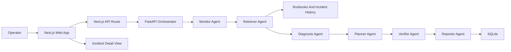

# Fleet Health Copilot

Fleet Health Copilot is a software-only capstone project for monitoring a simulated robotics or IoT fleet. It ingests telemetry, detects anomalies, retrieves operational context, and generates operator-facing incident reports.

## Architecture



- `apps/web` is the Clerk-protected Next.js dashboard.
- `services/orchestrator` is the FastAPI service for telemetry, RAG, orchestration, incidents, and metrics.
- `services/orchestrator/data` contains local seed events and runbooks.
- `services/mcp-*` contains MCP tool servers for telemetry, retrieval, incident, and maintenance workflows.
- `packages/contracts` contains JSON schemas for API contract alignment.

More detail:

- [Architecture](docs/architecture.md)
- [Demo runbook](docs/demo-runbook.md)
- [Technical report](docs/technical-report.md)
- [Presentation outline](docs/presentation-outline.md)
- [AWS deployment plan](docs/aws-deployment-plan.md)

## Local Setup

Install web dependencies:

```bash
npm install --workspace apps/web
```

Create and install the Python environment:

```bash
python -m venv .venv
.venv/bin/pip install -e "services/orchestrator[dev]"
```

Configure Clerk and the orchestrator URL:

```bash
cp apps/web/.env.example apps/web/.env.local
```

Set real `NEXT_PUBLIC_CLERK_PUBLISHABLE_KEY` and `CLERK_SECRET_KEY` values in `apps/web/.env.local`. The default orchestrator URL is `http://127.0.0.1:8000`.

Optional orchestrator retrieval settings:

- `FLEET_RETRIEVAL_BACKEND=lexical` keeps the local default lexical token search.
- `FLEET_RETRIEVAL_BACKEND=s3vectors` calls Amazon S3 Vectors `query_vectors` through boto3 (`s3vectors` client).
- Either `FLEET_S3_VECTORS_BUCKET` and `FLEET_S3_VECTORS_INDEX`, or `FLEET_S3_VECTORS_INDEX_ARN`, is required when `s3vectors` is selected.
- `FLEET_S3_VECTORS_EMBEDDING_DIM` defaults to `384` and must match the vector index dimension.
- `FLEET_S3_VECTORS_QUERY_VECTOR_JSON` is optional: a JSON array of floats used as the query vector for every search (same length as the embedding dim). Use it for integration checks against a known index; otherwise the service derives a deterministic pseudo-vector from the query string for API shape only—**production** queries should use the same embedding model as ingestion.

IAM: grant `s3vectors:QueryVectors`, and `s3vectors:GetVectors` when metadata or filters are returned (the backend sets `returnMetadata=true`). For indexing scripts, also grant `s3vectors:PutVectors`.

**Query embeddings** (`FLEET_EMBEDDING_PROVIDER`, default `hash`): `hash` (deterministic, no extra deps), `openai` (`FLEET_OPENAI_API_KEY`, `FLEET_OPENAI_EMBEDDING_MODEL`), `http` (`FLEET_EMBEDDING_HTTP_URL` returning JSON `{"embedding":[...]}`), or `sentence_transformers` (install `pip install -e "services/orchestrator[embeddings]"` and set `FLEET_SENTENCE_TRANSFORMER_MODEL`). The embedding dimension must match the S3 Vectors index.

**Index vectors from SQLite** (after runbooks are in the DB):

```bash
.venv/bin/python services/orchestrator/scripts/index_s3_vectors.py --bucket YOUR_BUCKET --index YOUR_INDEX
# or: --index-arn arn:aws:s3vectors:...
```

## Run Locally

Start the orchestrator:

```bash
PYTHONPATH=services/orchestrator/src .venv/bin/uvicorn fleet_health_orchestrator.main:app --reload --port 8000
```

Start the web app:

```bash
npm run web:dev
```

Open `http://localhost:3000`, sign in, and use the simulation button to create a thermal incident. The incident detail view shows confidence, agent trace, verification checks, evidence, and acknowledge/resolve actions.

## Demo Script

The local seed data covers two anomaly scenarios:

- Battery thermal drift on `robot-03`.
- Motor current spike on `robot-07`.

It also includes one normal motor-current event so the evaluation can report true negatives.

With the orchestrator running, index sample runbooks and historical incidents:

```bash
.venv/bin/python services/orchestrator/scripts/index_documents.py
```

Replay sample telemetry events:

```bash
.venv/bin/python services/orchestrator/scripts/replay_events.py
```

Run the end-to-end evaluation helper:

```bash
.venv/bin/python services/orchestrator/scripts/evaluate_pipeline.py
```

The evaluation helper posts each event to `/v1/orchestrate/event` and reports anomaly precision/recall, retrieval hit rate, agent task success rate, response latency, and time-to-diagnosis.

Then refresh the dashboard and open an incident detail page to inspect summary, hypotheses, actions, and retrieved runbook or incident evidence.

## MCP Tools

The `services/mcp-*` packages keep plain Python helper functions and expose minimal MCP server commands:

```bash
ORCHESTRATOR_API_BASE_URL=http://127.0.0.1:8000 mcp-telemetry
ORCHESTRATOR_API_BASE_URL=http://127.0.0.1:8000 mcp-retrieval
ORCHESTRATOR_API_BASE_URL=http://127.0.0.1:8000 mcp-incidents
```

Available tools:

- `mcp-telemetry`: `query_device_events(device_id, limit)` and `lookup_device_health(device_id)` delegate to `/v1/events`.
- `mcp-retrieval`: `search_operational_context(query, limit)` delegates to `/v1/rag/search`.
- `mcp-incidents`: `create_incident(event_payload)`, `search_incidents()`, `read_incident(incident_id)`, `update_incident(incident_id, status)`, and `search_maintenance_history(device_id)` delegate to incident endpoints.

## Verification

Run the main checks:

```bash
npm run web:lint
npm run web:build
PYTHONPATH=services/orchestrator/src .venv/bin/pytest -q services/orchestrator/tests
PYTHONPATH=services/mcp-telemetry/src .venv/bin/pytest -q services/mcp-telemetry/tests
PYTHONPATH=services/mcp-retrieval/src .venv/bin/pytest -q services/mcp-retrieval/tests
PYTHONPATH=services/mcp-incidents/src .venv/bin/pytest -q services/mcp-incidents/tests
```

The pull request test workflow runs the same web, orchestrator, and MCP checks.

You can also run the full local stack with Docker:

```bash
export NEXT_PUBLIC_CLERK_PUBLISHABLE_KEY=pk_test_xxxxxxxxxxxxxxxxxxxxxxxxxxxx
export CLERK_SECRET_KEY=sk_test_xxxxxxxxxxxxxxxxxxxxxxxxxxxx
docker compose up --build
```

The web container builds the Next.js app and serves it with `next start`. Supply real Clerk keys through the exported environment variables before using protected routes.

## Current Scope

The current implementation is a concise capstone core: deterministic six-agent orchestration (monitor through reporter), lexical RAG (default), optional AWS S3 Vectors RAG with pluggable embeddings, MCP tools, SQLite persistence, Clerk-protected OpenAI-style UI, evaluation metrics (including retrieval mean reciprocal rank and verifier pass rate), and AWS deployment scaffolding. Retrieval lives in `services/orchestrator/src/fleet_health_orchestrator/rag.py` with helpers in `embeddings.py`.

Next capstone-depth steps: optional LLM-backed fields beyond summary refine, wiring production embeddings consistently for S3 Vectors index and query, and executing production deployment (Terraform remote state, OIDC, and optional **`deploy-dev`** GitHub workflow `terraform plan` when **`AWS_ROLE_ARN`** is set).

## Git and history

If you rewrite `main` (for example to strip automated commit trailers), publish with:

```bash
git push --force-with-lease origin main
```

Operational checklist for S3 Vectors in AWS: [docs/s3-vectors-operations.md](docs/s3-vectors-operations.md). Marp slide export: [docs/presentation-slides.marp.md](docs/presentation-slides.marp.md).
