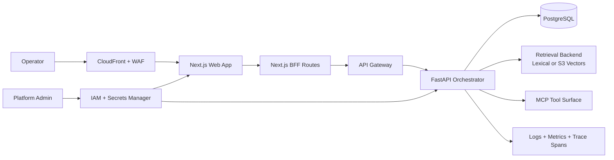
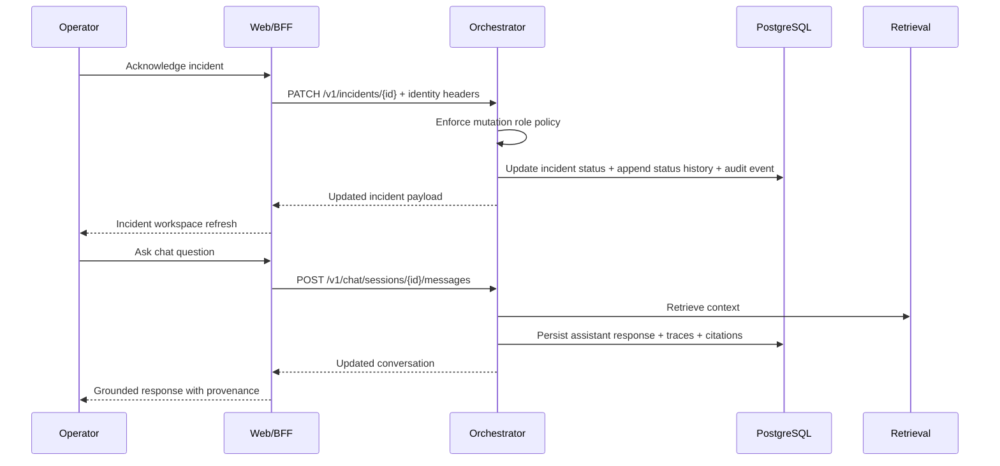
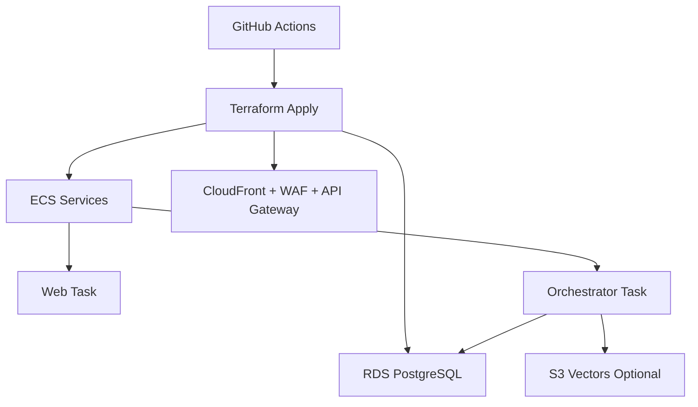

# Architecture

This document describes the production target architecture for Fleet Health Copilot.

It intentionally replaces demo-first assumptions and defines a platform shape that can be operated, secured, and scaled in real environments.

## Goals

- Multi-tenant fleet operations workspace with strict tenant boundaries.
- Authenticated and authorized workflows for incident actions, chat actions, and knowledge operations.
- Evidence-grounded orchestration with explicit provenance and auditability.
- Cost-governed LLM usage with enforceable policy controls.
- Operational reliability with observability, readiness checks, and deployment safeguards.

## System Overview

## Trust Boundaries

1. Edge boundary
- CloudFront + WAF is the public ingress boundary.
- DDoS, malicious input filtering, and rate shaping belong here first.

2. Web and BFF boundary
- Browser never directly calls privileged orchestration internals.
- Next.js BFF routes normalize auth context, tenant context, and response contracts.

3. Service boundary
- FastAPI orchestrator is the authoritative domain API for incidents, RAG, and chat orchestration.
- Service enforces request identity context and role-based mutation controls.

4. Data boundary
- Tenant-scoped domain records live in PostgreSQL for production.
- Retrieval indexes and document chunks are versioned and auditable.

## Identity and Authorization Model

Request identity model (current implementation foundation in orchestrator):

- Actor identity: supplied by trusted gateway/BFF header.
- Tenant identity: supplied per request and used for scope enforcement.
- Fleet identity: optional additional scope for fleet-level partitioning.
- Roles: comma-separated role claims normalized by middleware.

Policy model:

- Read endpoints: allowed by default unless stricter policy is configured.
- Mutation endpoints: require roles from configured mutation role list.
- Auth-required mode: rejects unauthenticated requests globally.
- Tenant-required mode: rejects authenticated requests with missing tenant scope.

This policy is configuration-driven and is designed to integrate with enterprise SSO claims at the BFF or gateway layer.

## Domain Architecture

Core domain entities:

- Tenant
- Fleet
- Actor
- Incident
- IncidentStatusHistory
- AuditEvent
- ChatSession
- ChatMessage
- RagDocument and RagIngestionJob

Key invariants:

- Mutations produce auditable side effects.
- Incident status transitions append status history.
- User-visible assistant outputs must include source provenance when retrieval hits exist.
- Error responses preserve API-compatible detail fields and structured error metadata.

## Runtime Flow (Incident Action)

## Service Components

Web application:

- Route-based product areas: operations, incidents, chat, knowledge, admin.
- BFF endpoints for request normalization, auth forwarding, and error mapping.

Orchestrator:

- Agent pipeline: Monitor, Retriever, Diagnosis, Planner, Verifier, Reporter.
- Chat tool orchestrator with policy controls and execution traces.
- Repository layer for incidents, chat, ingestion jobs, and audit/history records.
- Middleware stack for correlation IDs, identity context, and request logging.

MCP surface:

- Retrieval, incident operations, and telemetry lookups.
- Tool invocations are represented as explicit traceable operations.

## Data and Persistence Strategy

Current target posture:

- PostgreSQL is production source of truth.
- SQLite remains development/test convenience only.
- Runtime schema drift must be eliminated over time in favor of versioned migrations.

Required hardening path:

- Introduce migration lifecycle controls.
- Add tenant columns and role-sensitive indexes where needed.
- Add retention and archive policies for audit/event history.

## Reliability and Observability

Required capabilities:

- Correlation ID on all inbound and outbound service responses.
- Structured logs including actor and tenant context where present.
- Request latency, orchestration latency, and retrieval latency metrics.
- Chat tool call and trace span persistence for post-incident review.
- Readiness endpoints tied to storage and repository checks.

## Security and Compliance Controls

- Least-privilege IAM for runtime services and CI workflows.
- Secret material in managed secret store with rotation policy.
- Header trust restricted to BFF/API gateway origin paths.
- Audit coverage for incident mutations, knowledge mutations, and policy-relevant operations.

## Deployment Topology

## Incremental Rollout Plan

Phase 1 foundations:

- Request identity middleware and role-aware mutation gate in orchestrator.
- Tenant-scope enforcement toggle.
- BFF-only upstream communication pattern.

Phase 2 productization:

- Rebuild incident workspace and chat workflow around operator actions.
- Surface status history, audit events, and usage governance.

Phase 3 hardening:

- Migration framework and data lifecycle controls.
- SLOs, alerts, dashboards, and load-test gates in CI/CD.

## Compatibility Constraints

These interfaces must remain backward-compatible during transition:

- Legacy FLEET_* environment variable aliases.
- Error payload shape with both detail and structured error block.
- Canonical runbook IDs in production seed corpus.
- Existing MCP tool names and top-level contract behavior.
