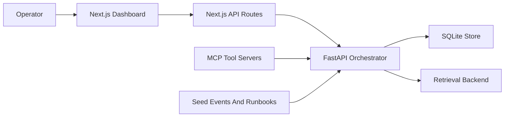
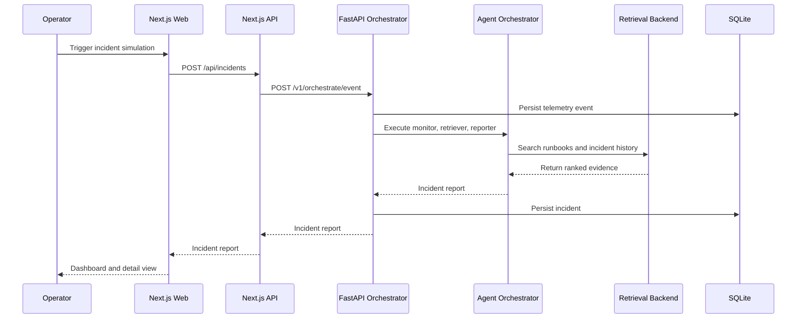
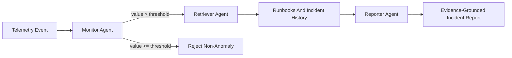

# Architecture

Fleet Health Copilot is a software-only incident operations platform for simulated robotics and IoT fleets. It demonstrates telemetry ingestion, deterministic multi-agent orchestration, retrieval-augmented context, MCP tool access, and operator-facing incident reports.

## System View

Primary components:

- `apps/web`: Clerk-protected Next.js dashboard for incident list/detail views and simulation.
- `services/orchestrator`: FastAPI service for telemetry ingestion, RAG search, incident orchestration, persistence, and metrics.
- `services/mcp-*`: MCP tool servers for telemetry, retrieval, and incident actions.
- `services/orchestrator/data`: JSONL seed data for demo events, runbooks, and historical incidents.
- `packages/contracts`: JSON Schemas for event and incident report shapes.

## Runtime Flow

## Agent Flow

Current agents are intentionally simple and deterministic:

- `MonitorAgent` flags events whose metric value exceeds the threshold.
- `RetrieverAgent` builds a query from metric, tags, and severity.
- `ReporterAgent` produces a structured incident report using retrieved runbook and incident evidence.

## Retrieval

Retrieval is behind a small backend interface:

- `LexicalRetrievalBackend` is the local default and ranks documents by token overlap.
- `S3VectorsRetrievalBackend` is an opt-in skeleton for future AWS S3 Vectors integration.
- `FLEET_RETRIEVAL_BACKEND=lexical` keeps local development dependency-light.

## MCP Tool Layer

The MCP layer exposes orchestrator capabilities as tool servers:

- `mcp-telemetry`: `query_device_events(device_id, limit)`
- `mcp-retrieval`: `search_operational_context(query, limit)`
- `mcp-incidents`: `create_incident(event_payload)`, `search_incidents()`, `read_incident(incident_id)`

These tools keep the capstone modular and make the orchestrator accessible to agent hosts without coupling them to the web UI.

## Deployment Shape

Local deployment uses Docker Compose:

- `web`: production-built Next.js app served with `next start`.
- `orchestrator`: FastAPI API served by Uvicorn.

CI runs web lint/build, orchestrator tests, and MCP tool tests. Terraform and AWS deployment are the next infrastructure expansion points.
