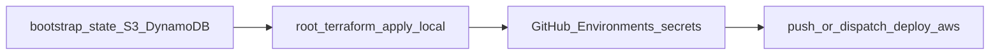

# Step-by-step: Deploy to AWS via GitHub Actions

Operator checklist for the [`deploy-aws`](../.github/workflows/deploy-aws.yml) workflow. Deep reference: [aws-deployment-plan.md](aws-deployment-plan.md), [terraform-bootstrap.md](terraform-bootstrap.md), [iam-github-actions.md](iam-github-actions.md).



## 0. Prerequisites

- [ ] **AWS account** with rights to create S3, DynamoDB, IAM, ECR, and (later) ECS/VPC resources you enable.
- [ ] **GitHub repository** slug `OWNER/REPO` (Settings → General → full name).
- [ ] **Branches**: `develop` → env **dev**; `staging` → **test**; `main` → **prod** (see workflow `select` job).
- [ ] **Clerk** publishable key + secret key (PK for GitHub Actions; SK into Secrets Manager after apply).
- [ ] **Local tools**: Terraform **1.9.x** (workflow uses 1.9.0), AWS CLI, Docker (only needed on the runner for CI; locally for optional smoke).

Local sanity check (optional):

```bash
bash scripts/verify_github_actions_deploy_prereqs.sh
```

## 1. Bootstrap remote state (once)

- [ ] `cd infra/terraform/bootstrap-state`
- [ ] `terraform init`
- [ ] `terraform apply` with a **globally unique** `state_bucket_name` and your `lock_table_name` (see [terraform-bootstrap.md](terraform-bootstrap.md) for the full example).

**Record for GitHub secrets (every Environment you use):**

| Value | GitHub secret name |
| --- | --- |
| S3 bucket name | `TF_STATE_BUCKET` |
| DynamoDB table name | `TF_LOCK_TABLE` |

## 2. First root-module apply (OIDC role — chicken and egg)

GitHub Actions needs `AWS_ROLE_ARN`, but Terraform creates that role when `github_repository` is set. Apply **once** from your laptop (or any principal with enough IAM/S3/etc. rights).

- [ ] Point the root module at the same remote backend:
  - Copy [infra/terraform/backend.tf.example](../infra/terraform/backend.tf.example) to `infra/terraform/backend.tf` and edit **bucket**, **region**, **dynamodb_table**, **key** (e.g. `fleet-health-copilot/dev/terraform.tfstate`), **or**
  - Run [scripts/terraform_remote_backend_init.sh](../scripts/terraform_remote_backend_init.sh) with `TF_STATE_BUCKET`, `TF_LOCK_TABLE`, `AWS_REGION`, and optional `TF_STATE_KEY`.
- [ ] `cd infra/terraform && terraform init` (with backend configured).
- [ ] `terraform apply` including:
  - `-var-file=env/dev.tfvars` (or the environment you bootstrap first),
  - `-var="github_repository=OWNER/REPO"`.

**IAM:** Default is `github_actions_attach_administrator_access = false`. The role gets **ECR push** inline only; for CI to run **full** `terraform apply`, either attach a scoped policy per [iam-github-actions.md](iam-github-actions.md) **after** you know the role name, or set `github_actions_attach_administrator_access = true` in that `env/*.tfvars` temporarily for classroom bootstrap, then tighten.

- [ ] Copy Terraform output **`github_actions_role_arn`** → GitHub secret **`AWS_ROLE_ARN`** (step 3).

```bash
terraform output -raw github_actions_role_arn
```

## 3. GitHub Environments and secrets

GitHub → **Settings → Environments**. Create **`dev`**, **`test`**, **`prod`** (minimum: the one matching the branch you will push first).

For **each** environment, under **Environment secrets**:

| Secret | Source |
| --- | --- |
| `AWS_ROLE_ARN` | `terraform output github_actions_role_arn` |
| `TF_STATE_BUCKET` | Bootstrap S3 bucket |
| `TF_LOCK_TABLE` | Bootstrap DynamoDB table |
| `NEXT_PUBLIC_CLERK_PUBLISHABLE_KEY` | Clerk dashboard (safe as build-arg) |

Optional **repository** **Variables** (Settings → Secrets and variables → Actions → Variables):

| Variable | When |
| --- | --- |
| `AWS_REGION` | If not `us-east-1` (workflow defaults to `us-east-1`). |
| `ENABLE_ECS` | Set to `true` **only after** a successful run created ECR repos (see step 7). |

Optional **Environment secrets** when `ENABLE_ECS=true`:

| Secret | Purpose |
| --- | --- |
| `VPC_ID` | Default VPC or your VPC id. |
| `PUBLIC_SUBNET_IDS_JSON` | JSON array string, e.g. `["subnet-aaa","subnet-bbb"]` (at least two subnets if required by validation). |
| `WEB_NEXT_PUBLIC_ORCHESTRATOR_API_BASE_URL` | Browser-facing orchestrator URL (ALB or custom domain) after you know it. |

- [ ] Add **protection rules** on **`prod`** (required reviewers / wait timer) if desired.

## 4. IAM for the GitHub OIDC role

- [ ] If AdministratorAccess is **not** attached, ensure the role can: read/write **Terraform state** (S3 + DynamoDB lock), run **this module’s** `terraform apply`, and push to **ECR** (ECR policy is attached by Terraform for the role it creates). See [iam-github-actions.md](iam-github-actions.md).

## 5. First `deploy-aws` run

- [ ] Push to **`develop`**, **`staging`**, or **`main`**, **or** **Actions → deploy-aws → Run workflow** and choose **dev** / **test** / **prod**.

The job: OIDC → S3 backend `backend.ci.hcl` → `terraform init` → `terraform apply` (images `latest` first) → build/push **web** and **orchestrator** to ECR → second `terraform apply` to pin **`container_image_tags`** to the commit SHA.

- [ ] If the job fails, read the log (missing secret, IAM `AccessDenied`, Terraform validation).

## 6. Populate Secrets Manager (runtime)

Terraform creates placeholders; values are **not** in state. Managed secrets use names like **`fleet-health-copilot-<environment>/<SECRET_NAME>`** (see [secrets.tf](../infra/terraform/secrets.tf): `${local.name_prefix}/${each.value}`).

- [ ] `terraform output -json managed_secret_arns` to list ARNs / confirm names.
- [ ] Put **Clerk secret key** (and any others you use), for example:

```bash
aws secretsmanager put-secret-value \
  --secret-id "fleet-health-copilot-dev/CLERK_SECRET_KEY" \
  --secret-string "$CLERK_SECRET_KEY"
```

Replace `dev` with `test` or `prod` to match the environment you deployed.

## 7. Enable ECS

- [ ] Confirm ECR repositories exist and at least one **`deploy-aws`** run succeeded (typically with `ENABLE_ECS` unset or not `true` yet).
- [ ] Set repository variable **`ENABLE_ECS`** to **`true`**.
- [ ] Add **`VPC_ID`** and **`PUBLIC_SUBNET_IDS_JSON`** to the matching **GitHub Environment** secrets.
- [ ] Set **`WEB_NEXT_PUBLIC_ORCHESTRATOR_API_BASE_URL`** when you have the public orchestrator URL; if the browser calls the orchestrator directly, configure orchestrator **`FLEET_CORS_ORIGINS`** in Terraform/task definition per [README](../README.md).
- [ ] Push again or **Run workflow** so Terraform updates ECS services and image tags.

Useful outputs after ECS is on:

```bash
terraform output web_load_balancer_dns_name
terraform output orchestrator_service_discovery_name
```

## 8. Optional: S3 Vectors RAG

- [ ] If `enable_s3_vectors_rag` is enabled in tfvars, follow [s3-vectors-operations.md](s3-vectors-operations.md) and `terraform output s3_vectors_orchestrator_env_hint`. Indexing remains an operator step (`index_s3_vectors.py`).

## 9. Verify

- [ ] GitHub Actions **deploy-aws** green for your branch/environment.
- [ ] ECR: images tagged with commit SHA and `latest`.
- [ ] ECS (if enabled): tasks healthy; ALB DNS loads the web app; Clerk sign-in works.
- [ ] Orchestrator (if reachable): `GET /health`, `GET /ready`.

---

**Short order:** bootstrap state → root apply with `github_repository` → set GitHub Environment secrets → run **deploy-aws** → `put-secret-value` for **CLERK_SECRET_KEY** → **`ENABLE_ECS`** + VPC secrets → re-deploy → verify.
